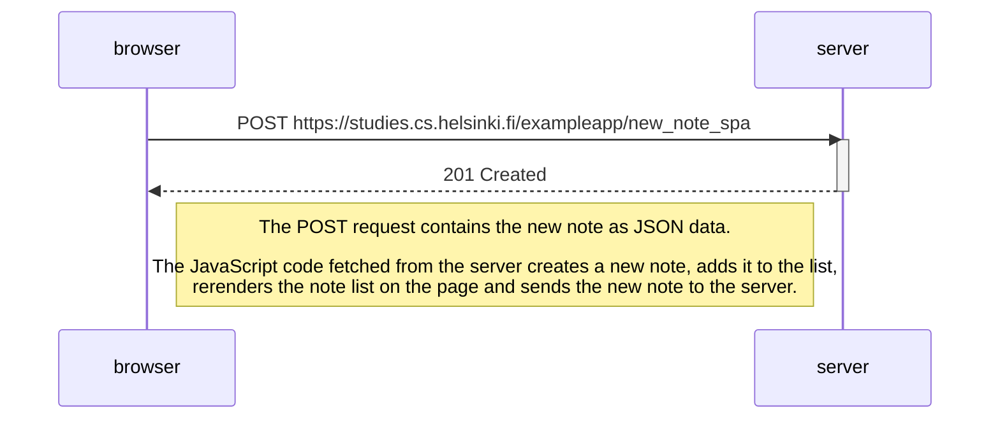

```mermaid
sequenceDiagram
    participant browser
    participant server
    
    browser ->> server: POST https://studies.cs.helsinki.fi/exampleapp/new_note_spa

    activate server
    server -->> browser: 201 Created
    deactivate server
    
    Note right of browser: The POST request contains the new note as JSON data.<br><br>The JavaScript code fetched from the server creates a new note, adds it to the list, <br>rerenders the note list on the page and sends the new note to the server.
```